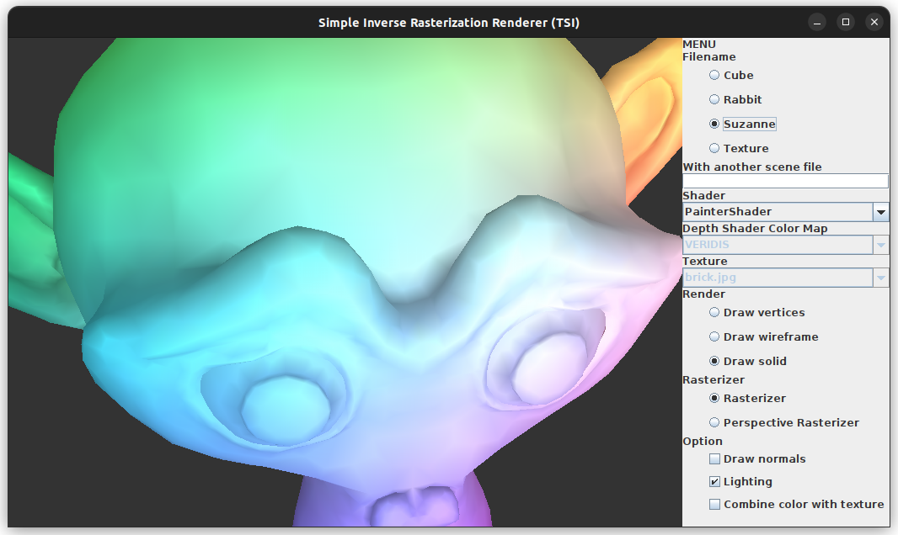
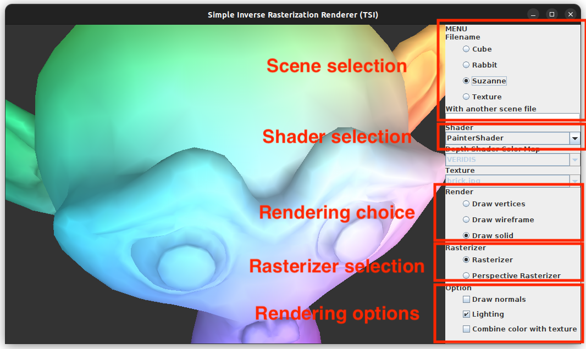
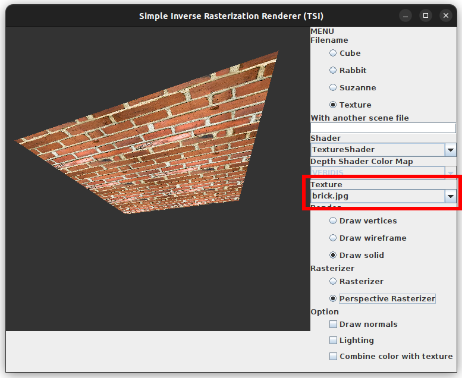

# A "Do it yourself" renderer

This is a simple rendering engine made in Java.



## The GUI

The graphical interface allows to choose different models, shaders,
rasterizers and options to render the scene.



You can choose the model to render in the filename part of the menu. If you have another `file.scene` which you want to render using this App, you can also copy the file in the `data/` dir and write his basename in the Text Field "With another scene file".

You can choose different shaders to render the model in the shader menu.
If you add your own shader class extending the `Shader` abstract class, it will be automatically listed in the shader menu after recompiling the project.

Selecting the TextureShader enabled the Texture menu to switch the menu available in the `data` folder when starting the application.



You can select the type of rendering in the Render menu: wireframe, vertex or face rendering.

Finally, in the option menu, you can enable and disable options such as rendering using the lighting and drawing the normals of each vertex.

## Build

To build the project use:

```bash
make
```

To run the project use:

```bash
make run
```

All the compiled classes are placed in the `build` folder.
To clean the project use:

```bash
make clean
```

To run the tests use the following command:

```bash
make tests
```

For a complete description of the build system see [BUILD.md](BUILD.md).
